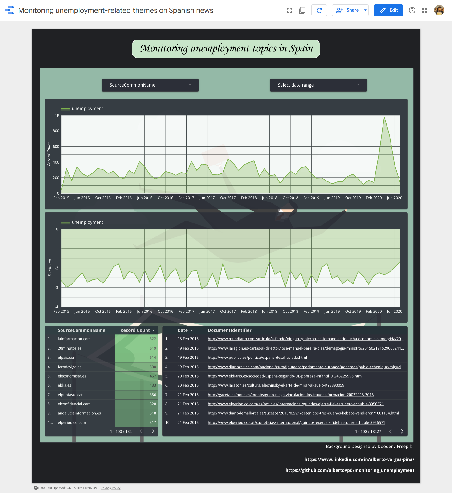

# Weekly monitoring Unemployment in Spain

Let's monitor what the Gdelt Project says about unemployment-related topics in Spain.

The first goal was to compare how often unemployment-related keywords appear in spanish news, and compare that amount with the data of 2008, the year of the world global crisis that heavily struck Spain.

Unfortunately, I also wanted to show the source, show the articles from which I am extracting that information, and this matter is only possible from 2015. Before that, you can get data (I got that of the King Emeritus of Spain from 1979 with its associated sentiment, but it is a blackbox, you can not know where that info comes from, or checking its fidelity).

I hope you enjoy the dashboard and the attached info. It is really simple, but I think is one of the prettiest I did :D 

- Dashboard => https://datastudio.google.com/u/1/reporting/a038e53e-ba0d-49a6-b8c9-6893445cc54a/page/UVSZB

*This schedule will run Every Sun at 05:00 Europe/Paris, starting Mon Aug 10 2020* 

